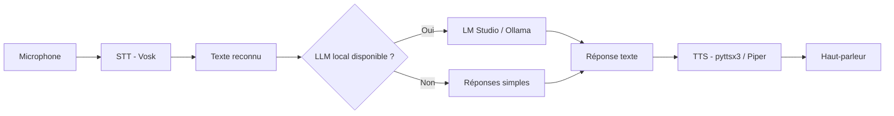

# Rafiki — Module voix local

> **Projet Makers 2026** — Robot compagnon intelligent pour enfants  
> **Dépôt GitHub :** https://github.com/mpoho/Rafiki  
> **Branche de travail actuelle :** `feat/test-tts-stt`

---

## 1. Présentation rapide (pour le groupe et le coach)

**Rafiki** est un robot compagnon destiné aux enfants. Il doit pouvoir :

- **écouter** l'enfant (reconnaissance vocale) ;
- **comprendre** ce qu'il dit (intelligence artificielle / LLM) ;
- **répondre à voix haute** (synthèse vocale) ;
- et, plus tard, gérer la vision, les routines, la mémoire, etc.

Ce dépôt contient le **module voix local** de Rafiki : les briques logicielles qui permettent au robot de **parler** et **d'écouter**, sans dépendre d'Internet pour la voix.

### Ce que j'ai mis en place

| Fonctionnalité | État | Technologie |
|----------------|------|-------------|
| Faire parler Rafiki (TTS) | ✅ Fonctionne | `pyttsx3` (fallback) / Piper (optionnel) |
| Écouter l'utilisateur (STT) | ✅ Fonctionne | Vosk (hors-ligne) |
| Conversation vocale simple | ✅ Fonctionne | STT + réponses simples + TTS |
| Connexion à un LLM local | ✅ Prévu | LM Studio ou Ollama |
| API HTTP pour le reste de l'équipe | ✅ Prévu | FastAPI |

### Schéma du flux conversationnel



---

## 2. Structure du dépôt

```
Rafiki/                        ← Racine du dépôt Git
├── voice/                     ← Cœur du module voix
├── scripts/                   ← Scripts de test rapides
├── models/                    ← Modèles lourds (Vosk, Piper) — non versionnés
├── outputs/                   ← Fichiers audio générés — non versionnés
├── requirements.txt           ← Dépendances Python
├── .env.example               ← Exemple de configuration
├── README.md                  ← Ce document (présentation groupe / coach)
├── README_VOICE.md            ← Documentation technique détaillée du module voix
└── main_voice_test.py         ← Premier test TTS minimal
```

> **Important :** les dossiers `models/`, `outputs/`, `.venv/` et le fichier `.env` ne sont **pas** sur GitHub (fichiers trop lourds ou sensibles).

---

## 3. À quoi sert chaque partie ?

### 3.1 Dossier `voice/` — Le cœur du module

C'est le **moteur voix** de Rafiki. Chaque fichier a un rôle précis :

| Fichier | Rôle | Analogie |
|---------|------|----------|
| **`stt.py`** | **Speech-To-Text** — écoute le micro et transforme la voix en texte | Les « oreilles » de Rafiki |
| **`tts.py`** | **Text-To-Speech** — transforme un texte en parole audible | La « bouche » de Rafiki |
| **`llm_client.py`** | Envoie du texte à un modèle d'IA local (LM Studio ou Ollama) et récupère une réponse | Le « cerveau » connecté |
| **`voice_pipeline.py`** | Enchaîne écoute → compréhension → réponse → parole | Le « fil conducteur » d'une conversation |
| **`voice_server.py`** | Expose tout ça via une **API web** (FastAPI) pour que d'autres parties du robot puissent l'utiliser | La « prise réseau » pour l'équipe |
| **`config.py`** | Lit les paramètres (chemins des modèles, langue, timeouts, URL du LLM) | Le « tableau de bord » de configuration |
| **`schemas.py`** | Définit le format des requêtes/réponses de l'API (validation des données) | Les « formulaires » de l'API |

#### Détail des fonctions principales

```python
# Écouter → retourne du texte
from voice.stt import listen
texte = listen(language="fr", timeout_seconds=8)

# Faire parler Rafiki
from voice.tts import speak
speak("Bonjour, je suis Rafiki.", language="fr")

# Demander une réponse au LLM local
from voice.llm_client import chat_with_local_model
reponse = chat_with_local_model("Bonjour", language="fr")

# Conversation complète : écoute + réponse + parole
from voice.voice_pipeline import voice_chat
resultat = voice_chat(language="fr")
```

---

### 3.2 Dossier `scripts/` — Tests rapides

Scripts pour **vérifier que chaque brique fonctionne**, sans lancer tout le robot.

| Script | Ce qu'il teste | Commande |
|--------|----------------|----------|
| **`test_tts.py`** | Rafiki parle une phrase de test | `py scripts/test_tts.py` |
| **`test_stt.py`** | Rafiki écoute 8 secondes et affiche le texte reconnu | `py scripts/test_stt.py` |
| **`test_voice_chat.py`** | Conversation complète : « Je t'écoute » → écoute → réponse → parole | `py scripts/test_voice_chat.py` |
| **`test_chat.py`** | Connexion au LLM local (sans micro ni haut-parleur) | `py scripts/test_chat.py` |
| **`test_speak.py`** | Test TTS en français et anglais | `py scripts/test_speak.py` |
| **`test_listen.py`** | Test STT en français et anglais | `py scripts/test_listen.py` |
| **`download_vosk_models.md`** | Instructions pour télécharger les modèles Vosk | — |

#### Exemple de déroulement `test_voice_chat.py`

```
Test conversation Rafiki
Rafiki parle : Je t'écoute.          ← TTS
Rafiki ecoute...                     ← STT (8 secondes)
Texte reconnu : bonjour              ← Affichage
Réponse Rafiki : Bonjour, je suis... ← Réponse (LLM ou règles simples)
Rafiki répond vocalement...          ← TTS
```

---

### 3.3 Dossier `models/` — Modèles lourds (local uniquement)

Ces fichiers sont **téléchargés manuellement** et **jamais commités** sur GitHub.

| Sous-dossier | Contenu | Taille approx. | Rôle |
|--------------|---------|----------------|------|
| `models/vosk/vosk-model-small-fr-0.22/` | Modèle Vosk français | ~40 Mo | Reconnaissance vocale hors-ligne |
| `models/vosk/vosk-model-small-en-us-0.15/` | Modèle Vosk anglais | ~40 Mo | Reconnaissance vocale anglais |
| `models/piper/fr/` | Voix Piper française | variable | Synthèse vocale naturelle (optionnel) |
| `models/piper/en/` | Voix Piper anglaise | variable | Synthèse vocale anglaise (optionnel) |

**Téléchargement modèle Vosk FR :**  
https://alphacephei.com/vosk/models/vosk-model-small-fr-0.22.zip

---

### 3.4 Fichiers de configuration

| Fichier | Rôle |
|---------|------|
| **`requirements.txt`** | Liste des bibliothèques Python à installer (`vosk`, `sounddevice`, `pyttsx3`, `fastapi`, etc.) |
| **`.env.example`** | Modèle de configuration (chemins, langue, URL du LLM). Copier en `.env` pour personnaliser. |
| **`.gitignore`** | Empêche de committer `.venv/`, `models/`, `.env`, fichiers audio, etc. |

---

## 4. Technologies utilisées

| Technologie | Type | Pourquoi ce choix ? |
|-------------|------|---------------------|
| **Python 3.12** | Langage | Simple, riche en bibliothèques audio/IA, compatible Raspberry Pi |
| **Vosk** | STT hors-ligne | Pas besoin d'Internet, fonctionne sur Raspberry Pi, léger |
| **pyttsx3** | TTS local | Fonctionne immédiatement sur Windows sans modèle à télécharger |
| **Piper** | TTS naturel | Voix plus naturelle (à installer plus tard sur le robot) |
| **sounddevice** | Capture micro | Accès au microphone depuis Python |
| **FastAPI + Uvicorn** | API web | Permet au reste de l'équipe d'appeler la voix via HTTP |
| **LM Studio** | LLM local | Modèle d'IA qui tourne sur le PC, sans cloud |
| **Ollama** | LLM local (option) | Alternative à LM Studio |

---

## 5. Comment installer et tester (démo pour le coach)

### Prérequis

- Windows 10/11 (tests locaux) ou Raspberry Pi (déploiement futur)
- Python 3.10+ installé (`py` sur Windows)
- Microphone branché et autorisé
- Haut-parleur ou casque

### Installation (une seule fois)

```powershell
cd Rafiki

# Créer l'environnement virtuel
py -m venv .venv
.\.venv\Scripts\Activate.ps1

# Installer les dépendances
pip install -r requirements.txt

# Télécharger le modèle Vosk français (obligatoire pour STT)
mkdir models\vosk
# Décompresser vosk-model-small-fr-0.22 dans models\vosk\
```

### Tests rapides (démo en 3 minutes)

```powershell
cd Rafiki

# 1. Rafiki parle
py scripts/test_tts.py

# 2. Rafiki écoute (parler quand "Parle maintenant." s'affiche)
py scripts/test_stt.py

# 3. Conversation complète
py scripts/test_voice_chat.py
```

### Lancer l'API (pour le reste de l'équipe)

```powershell
uvicorn voice.voice_server:app --reload
```

Puis ouvrir : http://127.0.0.1:8000/docs

Endpoints disponibles :

| Endpoint | Action |
|----------|--------|
| `GET /health` | Vérifier que le service tourne |
| `POST /speak` | Faire parler Rafiki |
| `POST /listen` | Écouter et retourner du texte |
| `POST /chat` | Envoyer du texte au LLM |
| `POST /voice-chat` | Conversation vocale complète |

---

## 6. Logique des réponses (sans LLM)

Quand **LM Studio ou Ollama n'est pas lancé**, Rafiki utilise des **réponses simples** définies dans `voice/voice_pipeline.py` :

| Ce que dit l'enfant | Réponse de Rafiki |
|---------------------|-------------------|
| « bonjour », « salut » | « Bonjour, je suis Rafiki. Je suis content de te parler. » |
| « école », « devoirs », « cours » | « D'accord, je peux t'aider avec tes devoirs. » |
| Autre phrase reconnue | « J'ai entendu ce que tu as dit. Je vais bientôt apprendre à mieux te répondre. » |
| Rien reconnu | « Je n'ai pas bien compris. Réessaie en parlant plus clairement. » |

Quand le **LLM local est disponible**, Rafiki lui envoie le texte et utilise sa réponse (plus intelligente et contextuelle).

---

## 7. Où en est le projet ? (état actuel)

### ✅ Ce qui fonctionne

- Synthèse vocale (TTS) via `pyttsx3`
- Reconnaissance vocale (STT) via Vosk (modèle français installé)
- Script de conversation vocale (`test_voice_chat.py`)
- API FastAPI prête à l'emploi
- Client LLM compatible LM Studio et Ollama
- Tests unitaires par brique (`test_tts`, `test_stt`, `test_chat`, etc.)
- Code versionné sur GitHub

### 🔄 En cours / à améliorer

- Qualité de reconnaissance vocale (modèle `small` → modèle plus grand possible)
- Voix Piper pour une synthèse plus naturelle
- Intégration avec le reste du robot (vision, routines, Raspberry Pi)
- Connexion stable au LLM local en conditions réelles

### 📋 Prochaines étapes suggérées

1. Tester sur Raspberry Pi avec micro et haut-parleur du robot
2. Installer Piper pour une voix plus naturelle
3. Connecter ce module à l'agent principal du robot
4. Améliorer les réponses avec un LLM adapté aux enfants
5. Ajouter la gestion de la mémoire de conversation

---

## 8. Pour le reste de l'équipe — Comment utiliser ce module

### Depuis du code Python (même machine)

```python
from voice.stt import listen
from voice.tts import speak
from voice.voice_pipeline import voice_chat

# Conversation complète en une ligne
resultat = voice_chat(language="fr")
print(resultat["heard_text"])      # Ce que l'enfant a dit
print(resultat["response_text"])   # Ce que Rafiki a répondu
```

### Depuis une autre application (HTTP)

```powershell
# Faire parler Rafiki
Invoke-RestMethod -Method Post http://127.0.0.1:8000/speak `
  -ContentType "application/json" `
  -Body '{"text":"Bonjour, je suis Rafiki.","language":"fr"}'

# Conversation vocale complète
Invoke-RestMethod -Method Post http://127.0.0.1:8000/voice-chat `
  -ContentType "application/json" `
  -Body '{"language":"fr","timeout_seconds":8}'
```

---

## 9. Questions fréquentes (pour la soutenance)

**Q : Pourquoi Vosk et pas Google Speech ?**  
R : Vosk fonctionne **hors-ligne**, sans Internet, directement sur Raspberry Pi. C'est essentiel pour un robot autonome.

**Q : Pourquoi pyttsx3 si Piper existe ?**  
R : `pyttsx3` fonctionne **immédiatement** sans télécharger de modèle. Piper donnera une voix plus naturelle plus tard.

**Q : Le robot a-t-il besoin d'Internet ?**  
R : Non pour écouter et parler. Internet (ou un PC local) est nécessaire seulement si on utilise un LLM cloud. Ici, le LLM tourne en **local** (LM Studio / Ollama).

**Q : Qu'est-ce qui est sur GitHub ?**  
R : Le **code source** uniquement. Pas les modèles lourds, pas les fichiers audio, pas les secrets (`.env`).

**Q : Comment une autre personne de l'équipe peut tester ?**  
R : Cloner le repo, installer les dépendances, télécharger le modèle Vosk, lancer `py scripts/test_voice_chat.py`.

---

## 10. Liens utiles

| Ressource | URL |
|-----------|-----|
| Dépôt GitHub | https://github.com/mpoho/Rafiki |
| Branche de travail | `feat/test-tts-stt` |
| Doc technique voix | `README_VOICE.md` |
| Modèle Vosk FR | https://alphacephei.com/vosk/models/vosk-model-small-fr-0.22.zip |
| LM Studio | https://lmstudio.ai |
| Ollama | https://ollama.ai |

---

*Document rédigé pour présentation au groupe et au coach — Projet Rafiki, Makers 2026.*
